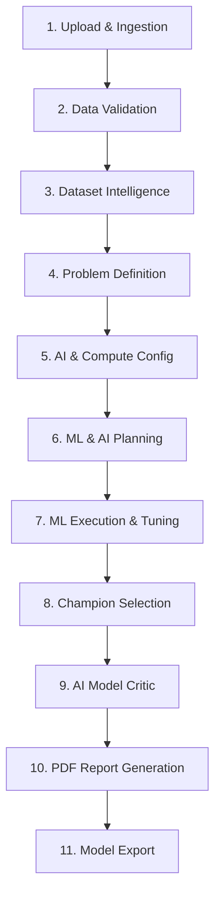

# 🚀 DeployAI — Intelligent Terminal-Based AutoML Platform

[](https://www.python.org/)
[](LICENSE)
[](#-architecture--11-stage-pipeline)
[](#-ai-integration--modes)

**DeployAI** is an end-to-end, terminal-native **AutoML & Model Training Platform**. Operating as a pure, lightweight, in-memory Python engine without web-server bloat, DeployAI automates the entire machine learning pipeline—from dataset ingestion and automatic schema merging to AI-assisted hyperparameter tuning, model governance, executive PDF reporting, and multi-format binary exporting.

---

## ✨ Key Features

- ⚡ **11-Stage In-Memory Pipeline**: Zero database or server overhead; processes everything safely and rapidly in local memory.
- 🤖 **Dual Execution Modes**:
  - **Deterministic Engine**: Rapid baseline pipelines using scikit-learn standard preprocessors and algorithms.
  - **AI-Assisted Engine**: Harnesses local LLMs (via [Ollama](https://ollama.com/)) or cloud models ([Groq](https://groq.com/), OpenAI) for intelligent feature engineering, pipeline planning, and model critique.
- 📊 **Multi-Dataset Ingestion & Schema Merging**: Pass single or multiple files (`.csv`, `.xlsx`, `.xls`). DeployAI validates schemas, drops duplicate columns, and concatenates datasets automatically.
- 🎯 **Automated Problem Detection**: Detects binary classification, multi-class classification, or regression tasks based on target label properties and cardinality.
- 🛠️ **Smart Tuning & Multi-Class Optimization**: Automatically injects hyperparameter search spaces (`GridSearch` / `RandomSearch`) and map classification metrics (e.g. `f1_macro`, `roc_auc_ovr`) to prevent underfitting or runtime failure.
- 🏆 **Champion Model Governance**: Compares candidate models deterministically across primary metrics (F1, Accuracy, MSE) to pick and serialize the winner.
- 📦 **Multi-Format Serialization**: Export champion models into standard formats: **Pickle** (`.pkl`), **Joblib** (`.joblib`), or **ONNX** (`.onnx`).
- 📄 **Executive PDF Reporting**: Generates sleek, comprehensive PDF reports complete with dataset summaries, candidate comparison tables, governance scores, and AI natural language critiques.
- ⏱️ **Integrated Benchmarking**: Track runtime latency, CPU/RAM utilization, AI provider overhead, and model sizes per stage.

---

## 📐 Architecture & 11-Stage Pipeline

DeployAI's execution engine orchestrates a strictly sequenced **11-Stage Pipeline** over domain-specific Python services:



### Stage Summary

| # | Stage | Service Module | Key Operations |
|---|---|---|---|
| 1 | **Upload** | `backend/app/upload/` | Ingests `.csv`, `.xlsx`, `.xls`. Merges multi-file datasets with matching schemas & removes duplicate columns. |
| 2 | **Validation** | `backend/app/upload/validator.py` | Checks datatypes, missing values, column integrity, and target column validity. |
| 3 | **Dataset Intelligence** | `backend/app/dataset_intelligence/` | Builds detailed statistical profiling (`DatasetContext`), feature types, distributions, and missingness metrics. |
| 4 | **Problem Definition** | `backend/app/problem_definition/` | Infers problem type: Binary Classification, Multi-class Classification, or Regression. |
| 5 | **AI Configuration** | `backend/app/ai_providers/` | Detects hardware compute bounds (CPU, RAM) and detects local/cloud AI models. |
| 6 | **Planning** | `backend/app/ml_plan/` & `ai_planning/` | Selects preprocessors, scaling strategies, candidate models, and hyperparameter search grids. |
| 7 | **Execution** | `backend/app/ml_execution/` | Performs stratified split, fits transformers, executes grid/random hyperparameter tuning, and scores models. |
| 8 | **Champion Selection** | `backend/app/model_governance/` | Evaluates model candidates deterministically and crown the champion based on target metrics. |
| 9 | **AI Explanation** | `backend/app/ai_model_critic/` | Generates a natural-language AI critique evaluating model strengths, trade-offs, and deployment risks. |
| 10 | **PDF Generation** | `backend/app/reporting/` | Compiles results into a multi-page PDF executive report (`reports/exec_report_*.pdf`). |
| 11 | **Export** | `backend/app/workspace/` | Serializes trained champion model binary (`models/model_*.pkl`, `.joblib`, or `.onnx`). |

---

## ⚡ Quick Start

### 1. Prerequisites
- **Python 3.10+**
- (Optional) [Ollama](https://ollama.com/) running locally for local LLM inference.

### 2. Installation
Clone the repository and install dependencies:

```bash
git clone https://github.com/krishtewatia/deploy_ai.git
cd deploy_ai
pip install -r requirements.txt
```

---

## 🖥️ Usage

DeployAI provides both an **interactive wizard** for easy guided execution and a **headless CLI** for automation and scripts.

### 1. Interactive Setup Wizard (Recommended)

Run the wizard to be guided step-by-step through dataset selection, target inference, AI model configuration, and export options:

```bash
python cli.py
```
*(Or explicitly pass `-i` / `--interactive`)*

**Wizard Features**:
1. 📁 **Dataset Selection**: Scans the `datasets/` directory or accepts custom file paths. Supports comma-separated paths for merging multiple files (e.g. `datasets/iris.csv,datasets/Iris.csv`).
2. 🎯 **Target Column**: Auto-detects target labels or allows manual selection.
3. 📦 **Export Format**: Choose between `.pkl`, `.joblib`, or `.onnx`.
4. 🤖 **AI Provider Setup**:
   - Detect and select installed local **Ollama** models (`llama3.1`, `phi3`, etc.).
   - Dynamically **pull/download** new Ollama models directly from the CLI.
   - Configure cloud providers (**Groq** / **OpenAI**) by entering your API key.
   - Select **Deterministic Baseline Mode** to bypass AI LLM calls.

---

### 2. Headless CLI Execution

For scripted environments, CI/CD, or fast execution, pass arguments directly to `cli.py`:

```bash
# Basic run with standard dataset
python cli.py --dataset datasets/iris.csv --target species

# Merge multiple datasets and export as joblib
python cli.py --dataset datasets/iris.csv,datasets/Iris.csv --mode deterministic --format joblib

# Run with verbose debug output
python cli.py --dataset datasets/sample.csv --verbose
```

#### CLI Command Options

| Argument | Short | Description | Default |
|---|---|---|---|
| `--dataset` | `-d` | Path to dataset file(s). Supports comma-separated paths. | Interactive prompt |
| `--target` | `-t` | Target label column to predict. | Auto-inferred |
| `--mode` | `-m` | Planning mode (`deterministic` or `ai_assisted`). | `deterministic` |
| `--format` | `-f` | Model export format (`pickle`, `joblib`, `onnx`). | `pickle` |
| `--interactive` | `-i` | Force launching the interactive questionnaire wizard. | `False` |
| `--verbose` | `-v` | Enable detailed debug log output. | `False` |

---

## 🤖 AI Integration & Providers

DeployAI seamlessly toggles between deterministic baseline execution and AI-assisted optimization:

- **Local Ollama Integration**: Connects via HTTP API to local Ollama instances (`http://localhost:11434`). The CLI can list active models and trigger `ollama pull <model>` commands directly.
- **Cloud Providers**: Supports OpenAI-compatible APIs (including [Groq](https://groq.com/)). Provide an API key via environment variables or prompt entry.
- **Environment Variables**:
  Create a `.env` file in the project root:
  ```env
  GROQ_API_KEY=your_groq_api_key_here
  OPENAI_API_KEY=your_openai_api_key_here
  ```

---

## ⏱️ Benchmarking & Testing

### 📊 Performance Benchmarking
DeployAI features a built-in benchmarker that monitors runtime latency, CPU usage, RAM footprint, AI response latency, and serialized file sizes:

```bash
python benchmark.py
```
Outputs execution benchmarks directly to terminal and generates report metrics.

### 🧪 Unit & Integration Test Suites

Run unit tests for core pipeline engines, serializers, and CLI parsers:
```bash
pytest backend/tests/test_deploy_ai_engine.py backend/tests/test_engine_cli.py
```

Run the end-to-end integration test suite across provided datasets:
```bash
python tester.py
```
This tests full pipeline execution, generating test logs along with JSON and PDF reports in `reports/`.

---

## 📂 Repository Structure

```
deploy_ai/
├── backend/
│   └── app/
│       ├── ai_model_critic/        # AI natural language critique generator
│       ├── ai_model_optimizer/     # Hyperparameter & pipeline prompt optimization
│       ├── ai_planning/            # LLM-assisted ML pipeline planning
│       ├── ai_providers/           # Ollama & OpenAI API adapters & discovery
│       ├── dataset_intelligence/   # Dataset statistical profiling & metrics
│       ├── hardware/               # CPU & RAM capability detector
│       ├── ml_execution/           # Model training, train-test split, tuning
│       ├── ml_plan/                # Deterministic pipeline planning
│       ├── model_governance/       # Champion model selection logic
│       ├── pipeline/               # 11-Stage orchestrator engine
│       ├── problem_definition/     # Automated task type inference
│       ├── reporting/              # PDF Executive report generator
│       ├── upload/                 # Ingestion, schema verification, merging
│       └── workspace/              # Model binary serialization & workspace IO
├── datasets/                       # Sample & input datasets
├── models/                         # Output serialized champion models (.pkl, .joblib, .onnx)
├── reports/                        # Output generated PDF executive reports
├── benchmark.py                    # Pipeline runtime & memory benchmarker
├── cli.py                          # Interactive & headless CLI entrypoint
├── tester.py                       # Automated E2E integration testing script
└── requirements.txt                # Python dependencies
```

---

## 📄 Output Artifacts

Upon running a pipeline, DeployAI generates two main artifacts:
1. **Champion Model Binary**: Saved in `models/` (e.g. `models/model_001_RandomForest.pkl`).
2. **Executive PDF Report**: Saved in `reports/` (e.g. `reports/exec_report_*.pdf`), providing a formal summary of dataset metrics, candidate model scores, and AI recommendations.

---

## 📜 License

This project is licensed under the [MIT License](LICENSE).
